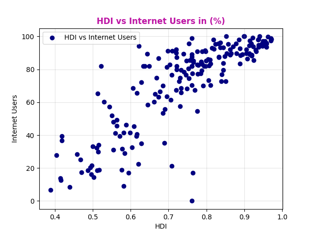
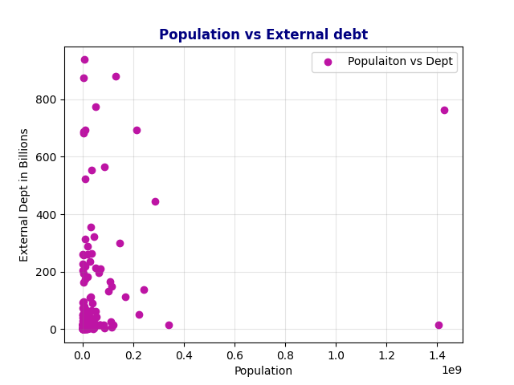
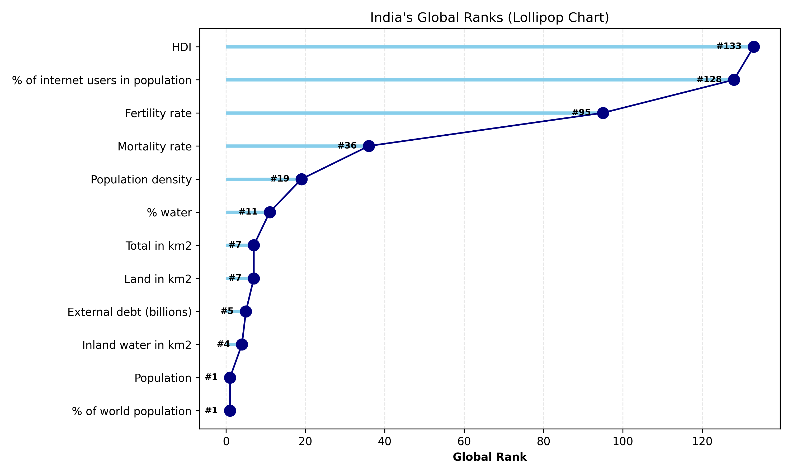
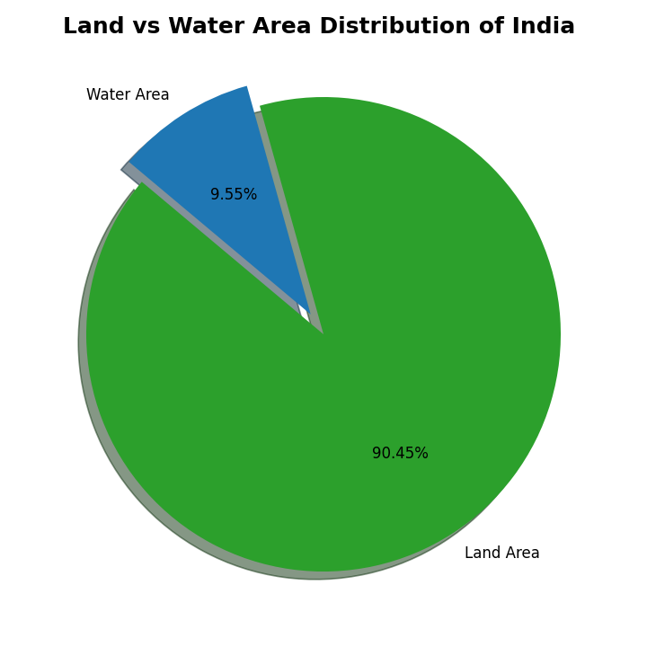
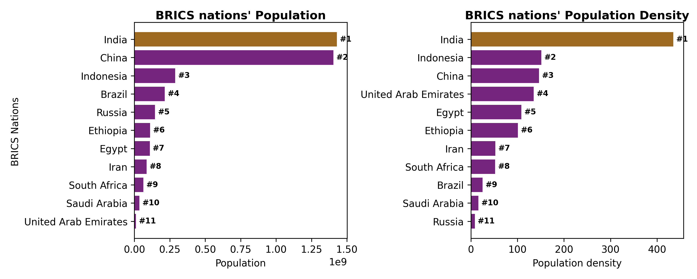
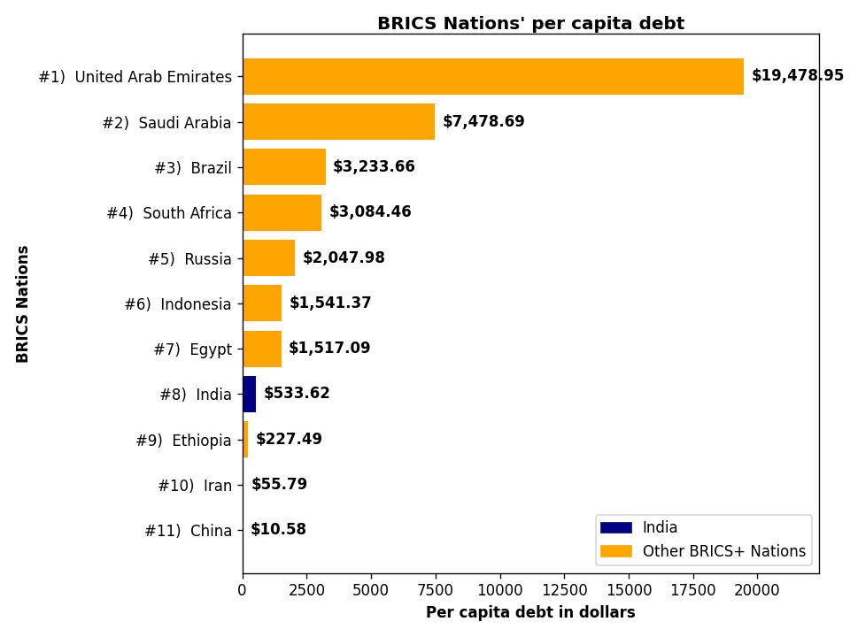

# 🌍 Country Data Analysis

A comprehensive **Exploratory Data Analysis (EDA)** of global countries' data — covering **Population, External Debt, HDI, Area, Internet Users, and more** — built entirely using **Python, Pandas, NumPy, and Matplotlib**.

Special focus is given to **🇮🇳 India**, analyzed across multiple dimensions for deeper insights.

---

## 📑 Table of Contents

1. [Project Overview](#-project-overview)
2. [Tech Stack](#-tech-stack)
3. [Data Cleaning](#-data-cleaning)
4. [Basic Statistics & Aggregations](#-basic-statistics--aggregations)
5. [Visual Analysis](#-visual-analysis)
   - [HDI & Internet Users Distribution](#1-hdi--internet-users-distribution)
   - [Population vs External Debt](#2-population-vs-external-debt)
6. [Deep Dive: India 🇮🇳](#-deep-dive-india-)
   - [India's Global Ranks](#1-indias-global-ranks)
   - [Land vs Water Distribution](#2-land-vs-water-area-distribution)
   - [BRICS Population & Density](#3-brics-population--density-comparison)
   - [BRICS Per Capita Debt](#4-brics-per-capita-external-debt)
7. [Key Takeaways](#-key-takeaways)

---

## 📖 Project Overview

This project performs a **comprehensive data analysis of countries** across key development and economic indicators. The workflow includes:

- **Data cleaning** using Pandas functions (`isnull`, `fillna`, `duplicated`)
- **Statistical aggregation** using `describe()` and group-by operations
- **Visual analysis** using histograms, scatter plots, lollipop charts, pie charts, and bar charts
- **Country-specific deep dive** on India — analyzing global ranks, land-water distribution, and BRICS positioning

---

## 🛠️ Tech Stack

| Tool | Purpose |
|------|---------|
| 🐍 Python | Core language |
| 🐼 Pandas | Data manipulation & cleaning |
| 🔢 NumPy | Numerical operations |
| 📊 Matplotlib | Data visualization |

---

## 🧹 Data Cleaning

In the first step, data was cleaned using multiple Pandas functions:

- `isnull()` — to detect missing values
- `fillna()` — to replace missing values
- `duplicated()` — to identify duplicate rows

> 💡 **Why Median?**
> Missing values were filled using the **median** rather than the mean, because the median is **robust to outliers**. This ensured that extreme values did not skew the imputed data.

---

## 📊 Basic Statistics & Aggregations

Statistical Details:

### 🏆 Top 5 Countries by Population

| index | Country name | Population |
|------:|--------------|-----------:|
| 1 | 🇮🇳 India | 1,429,404,000.00 |
| 2 | 🇨🇳 China | 1,404,890,000.00 |
| 3 | 🇺🇸 United States | 341,784,857.00 |
| 4 | 🇮🇩 Indonesia | 288,315,089.00 |
| 5 | 🇵🇰 Pakistan | 241,499,431.00 |

### 📉 Bottom 5 Countries by Population

| index | Country name | Population |
|------:|--------------|-----------:|
| 1 | 🇻🇦 Vatican City | 882.00 |
| 2 | 🇹🇻 Tuvalu | 10,643.00 |
| 3 | 🇳🇷 Nauru | 11,680.00 |
| 4 | 🇵🇼 Palau | 16,733.00 |
| 5 | 🇸🇲 San Marino | 34,167.00 |

### 🥇 Top 5 Countries by HDI

| index | Country name | HDI |
|------:|--------------|----:|
| 1 | 🇮🇸 Iceland | 0.97 |
| 2 | 🇳🇴 Norway | 0.97 |
| 3 | 🇨🇭 Switzerland | 0.97 |
| 4 | 🇩🇰 Denmark | 0.96 |
| 5 | 🇸🇪 Sweden | 0.96 |

### 🥉 Bottom 5 Countries by HDI

| index | Country name | HDI |
|------:|--------------|----:|
| 1 | 🇸🇸 South Sudan | 0.39 |
| 2 | 🇸🇴 Somalia | 0.40 |
| 3 | 🇨🇫 Central African Republic | 0.41 |
| 4 | 🇹🇩 Chad | 0.42 |
| 5 | 🇳🇪 Niger | 0.42 |

### 💰 Top 5 Countries by External Debt (Billions)

| index | Country name | External Debt (B USD) |
|------:|--------------|----------------------:|
| 1 | 🇦🇹 Austria | 937.31 |
| 2 | 🇲🇽 Mexico | 880.00 |
| 3 | 🇳🇴 Norway | 875.60 |
| 4 | 🇰🇷 South Korea | 774.39 |
| 5 | 🇮🇳 India | 762.77 |

---

## 📈 Visual Analysis

### 1. HDI & Internet Users Distribution

#### 🔍 HDI Distribution (Left Chart)
- HDI values range from **~0.39 to ~0.97**, spanning low to very high human development.
- Distribution is **left-skewed** — most countries cluster at **higher HDI values (0.75–0.95)**.
- A notable spike at **~0.75** indicates a large group of countries at the "high development" threshold.
- A smaller peak near **0.55–0.60** shows a secondary cluster of medium-development nations.
- Very few countries fall below **0.45** — the lowest development tier.

#### 🔍 Internet Users Distribution (Right Chart)
- The distribution is **heavily left-skewed** — most countries have **80–100% internet penetration**.
- A sharp spike near **95–100%** shows many highly connected nations.
- A smaller cluster around **15–35%** represents developing regions with limited internet access.
- Very few countries fall below **10%**, indicating near-universal minimum connectivity globally.

---

### 2. Population vs External Debt

- **No strong correlation** (Pearson `corr ≈ 0.24`) between population and external debt.
- Smaller countries (Austria, Norway) can carry **higher absolute debt** than more populous nations.
- **India & China** appear as outliers — huge populations but moderate debt levels.

> 📌 **Takeaway:** Absolute debt alone is misleading; **per capita debt** offers a fairer comparison.

---

## 🇮🇳 Deep Dive: India

### 1. India's Global Ranks

The lollipop chart below shows India's rank across **11 global indicators** — a lower rank number means a better standing:

- 🥇 **#1** — Population & % of World Population
- 🌍 **#7** — Total Area & Land Area
- 💰 **#5** — External Debt (absolute)
- 📡 **#128** — Internet Users %
- ⚠️ **#133** — HDI *(biggest concern)*

> **Insight:** India leads the world in **size & population**, but lags far behind in **human development** and **digital access**.

---

### 2. Land vs Water Area Distribution

- **🌊 Water Area — 9.55%**
  India's water coverage is relatively **low** compared to its massive population, industrial demand, and agricultural needs.

- **🏞️ Land Area — 90.45%**
  The overwhelming majority of India's area is land — which, combined with a low water share, **may lead to a future water crisis**.

> **Takeaway:** With only **9.55% water area** supporting **over 1.4 billion people**, India faces significant pressure on water resources. This highlights the urgent need for **water conservation, efficient irrigation, and sustainable industrial usage**.

---

### 3. BRICS Population & Density Comparison

#### 🔍 Population Ranking (Left Chart)
- 🇮🇳 **India (#1)** and 🇨🇳 **China (#2)** dominate BRICS — together accounting for **over 2.8 billion people** (nearly **35% of the world's population**).
- 🇮🇩 **Indonesia (#3)** is a distant third at ~280 million.
- 🇧🇷 **Brazil (#4)**, 🇷🇺 **Russia (#5)**, and 🇪🇹 **Ethiopia (#6)** follow, each in the 100–220 million range.
- 🇦🇪 **UAE (#11)** has the smallest population among BRICS nations.

#### 🔍 Population Density Ranking (Right Chart)
- 🇮🇳 **India (#1)** leads again with **~480 people/km²** — extreme population concentration.
- 🇮🇩 **Indonesia (#2)** and 🇨🇳 **China (#3)** follow; China's density (~150/km²) is **far lower** than India's.
- 🇦🇪 **UAE (#4)** and 🇪🇬 **Egypt (#5)** show high density despite smaller populations — largely due to **limited habitable land**.
- 🇷🇺 **Russia (#11)** has the **lowest density** in BRICS, given its vast landmass and harsh climate.

#### 💡 Why This Matters
- **High-density** countries like India face pressure on **infrastructure, water, and housing**.
- **Low-density** countries like Russia face **logistical challenges** in resource distribution.
- These patterns shape each nation's **urban planning, agricultural policy, and economic strategy**.

---

### 4. BRICS Per Capita External Debt

India is highlighted in **blue** for emphasis.

#### 🥇 Highest Per Capita Debt
- 🇦🇪 **UAE (#1)** — **$19,478.95** per person *(~36× India's figure)*
- 🇸🇦 **Saudi Arabia (#2)** — **$7,478.69** *(>4× India's)*
- 🇧🇷 **Brazil (#3)** — **$3,233.66**
- 🇿🇦 **South Africa (#4)** — **$3,084.46**

#### 📊 Middle Tier
- 🇷🇺 **Russia (#5)** — $2,047.98
- 🇮🇩 **Indonesia (#6)** — $1,541.37
- 🇪🇬 **Egypt (#7)** — $1,517.09

#### 🇮🇳 India's Position
- **India (#8)** — **$533.62** per capita
- Remarkably low compared to its total external debt (~$762 billion).
- Shows that India's **massive population dilutes the absolute debt burden**.

#### 📉 Lowest Per Capita Debt
- 🇪🇹 **Ethiopia (#9)** — $227.49
- 🇮🇷 **Iran (#10)** — $55.79
- 🇨🇳 **China (#11)** — **$10.58** *(lowest in BRICS, despite being the 2nd-largest economy)*

#### 📋 Summary Table

| Rank | Country | Per Capita Debt (USD) |
|-----:|---------|----------------------:|
| 1 | 🇦🇪 UAE | $19,478.95 |
| 2 | 🇸🇦 Saudi Arabia | $7,478.69 |
| 3 | 🇧🇷 Brazil | $3,233.66 |
| 4 | 🇿🇦 South Africa | $3,084.46 |
| 5 | 🇷🇺 Russia | $2,047.98 |
| 6 | 🇮🇩 Indonesia | $1,541.37 |
| 7 | 🇪🇬 Egypt | $1,517.09 |
| **8** | **🇮🇳 India** | **$533.62** |
| 9 | 🇪🇹 Ethiopia | $227.49 |
| 10 | 🇮🇷 Iran | $55.79 |
| 11 | 🇨🇳 China | $10.58 |

> 💡 **Fun Fact:** A single UAE citizen "owes" more in external debt than **36 Indian citizens combined**.

---

## 🎯 Key Takeaways

1. **HDI is distributed more evenly** across countries, while **internet penetration is highly polarized**.
2. **Population does not predict external debt** — smaller developed nations often carry higher absolute debt.
3. **India is #1 in population and density**, but ranks poorly in **HDI (#133)** and **internet access (#128)**.
4. **India's per capita debt is among the lowest in BRICS** — a direct consequence of its population size.
5. **Water scarcity is a looming risk** for India — only **9.55%** of its area is water, supporting **1.4B+ people**.

---

## 📌 Conclusion

This analysis highlights how **absolute numbers can be misleading** without context. Metrics like **per capita debt**, **population density**, and **HDI ranks** reveal a more nuanced picture of a nation's development, pressure points, and global standing.

India, despite being a **global giant in size and population**, faces critical challenges in **human development**, **digital access**, and **water security** — making data-driven policy essential for its future.

---

⭐ *If you found this analysis useful, consider giving this repo a star!*
